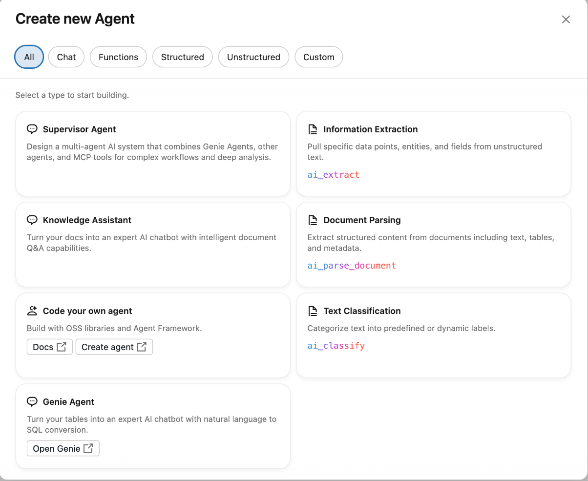
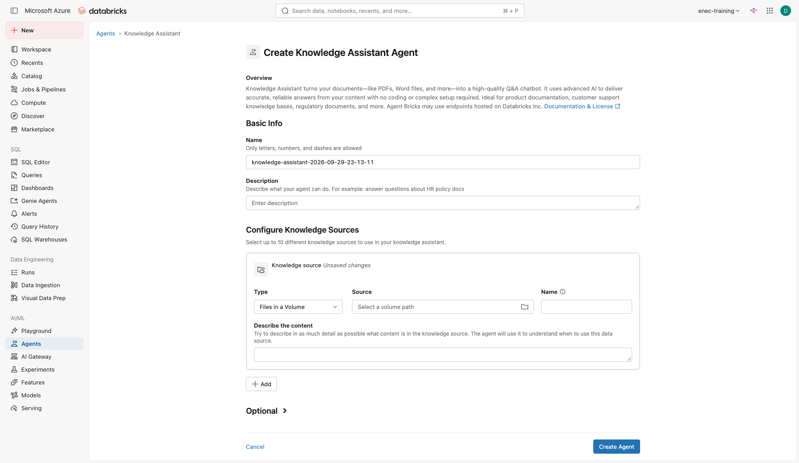

# Lab 4: Knowledge Assistant, "ask the regulations"

**Goal:** a question and answer agent over public regulatory documents, with citations, that you improve with feedback.
**Code written:** none.

!!! warning "Start this on Day 1"
    The first sync of the documents can take up to a few hours. Do Part A at the end of Day 1 so the agent is ready on Day 2. A trainer-built copy exists as a backup.

Documents: public regulations from the national nuclear regulator (FANR) and selected IAEA safety standards, copied into your volume `your_catalog.your_schema.docs` when you ran the setup notebook. See [Materials](../materials.md) for the list and sources.

## Part A: create the agent (Day 1)

1. Open **Agents** in the left navigation, click **Create Agent**, choose **Knowledge Assistant**.

    

2. Name: `your-name-regulations-assistant` (only letters, numbers and dashes are allowed — use the dashed name the setup notebook printed for you).
3. Description: `Answers questions about published nuclear regulations and IAEA safety standards, with citations.`
4. Under **Configure Knowledge Sources**, keep type **Files in a Volume**, pick `your_catalog.your_schema.docs` as the source, name it `regulations`, and in **Describe the content** write: `Public FANR regulations and IAEA safety guides in PDF`.

    

5. Expand **Optional** and add these instructions — same pattern as Lab 1 and Lab 2, mostly **rules**
   and one explicit **refuse** ("do not guess"):

    ```text
    Answer only from the documents provided. Always cite the document and article.
    If the answer is not in the documents, say so and do not guess.
    Answer in the language of the question (English or Arabic).
    ```

6. Click **Create Agent**. Leave it to sync overnight.

## Part B: test it (Day 2)

Open the agent and ask the questions on your question sheet. For each:

- Click **View sources** and check the cited document and article.
- Click **View thoughts** to see how the answer was assembled.
- Score the answer 0, 1 or 2 on the sheet (wrong, partly right, right and correctly cited).

Try two trick questions as well:

```text
What is the maximum allowed reactor power at Unit 3?
```
```text
Summarise the requirements for operator certification in three bullets, in Arabic.
```

**Check yourself**

- [ ] What did the agent do when the answer was not in the documents? Is that the behaviour you want?
- [ ] Did the citation point to the right article or only to the right document?

## Part C: improve it

1. Open **Improve quality**.
2. For an answer that scored 0 or 1, add an **Example**: the question, the answer you expected, and a **Guideline** explaining why (for example "When asked about training requirements, cite the specific article number").
3. Save and re-ask the question.
4. Repeat for two questions. Track the score before and after on the sheet.

**Check yourself**

- [ ] Who in a real department should write these guidelines?
- [ ] What happens when a regulation is updated? What has to change in the agent?

## Stretch

Open the agent in **AI Playground** and click **Get code**. Read how an application would call this agent. Discuss: where would a human check the answer before it reaches a decision?
