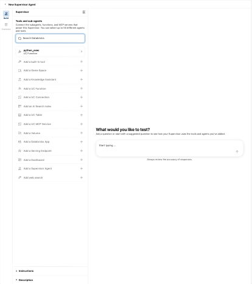

# Lab 5: Supervisor Agent

**Goal:** one chat that answers both data questions (Genie Agent from Lab 2) and document questions (Knowledge Assistant from Lab 4), by routing to the right sub-agent.
**Code written:** none.

Source: adapted from the Databricks docs "Supervisor Agent".

## Part A: predict the routing

Before building, decide with your partner which sub-agent should answer each question. Write your prediction down.

| # | Question | Data or documents? |
|---|---|---|
| 1 | How many corrective work orders are open on Unit 2? | |
| 2 | What does the regulation say about emergency drills frequency? | |
| 3 | Which technician closed the most work orders in August? | |
| 4 | Which documents apply to transporting radioactive material? | |
| 5 | List overdue preventive work orders on assets covered by the physical protection regulation | |
| 6 | What is the certification requirement for a reactor operator? | |

## Part B: build it

1. **Agents > Create Agent > Supervisor Agent**.

    

2. Name: `your-name maintenance and regulations`.
3. The builder opens with `python_exec` already attached. Click **Add a Genie Space** and pick your Genie Agent from Lab 2. Description:

    

    ```text
    Use for questions about work orders, assets, technicians, units, dates, counts and trends. Data is in tables.
    ```

4. Click **Add a Knowledge Assistant** and pick yours from Lab 4. Description:

    ```text
    Use for questions about what regulations or safety standards require, definitions, articles and documents.
    ```

5. Open **Instructions** at the bottom of the left panel and paste:

    ```text
    Route each question to the most relevant agent. If a question needs both, call both and combine the answers. State which source each part of the answer came from.
    ```

6. Test with the six questions from Part A in the right-hand panel, then save the agent. Compare with your predictions.

## Part C: break it

1. Change the Genie Agent description to `General assistant` and the Knowledge Assistant description to `Helps with questions`.
2. Ask the six questions again. Count how many are routed correctly now.
3. Restore good descriptions.

**Check yourself**

- [ ] Descriptions are the only thing the supervisor uses to route. What does that mean for how carefully they should be written?
- [ ] Question 5 needs both agents. Did the combined answer make sense? Would you trust it?

## Stretch

Click **Add a UC Function** and attach `your_catalog.your_schema.open_work_orders`. Ask a question that the function answers faster than Genie would. Then check which permissions a user needs to run the supervisor end to end.
