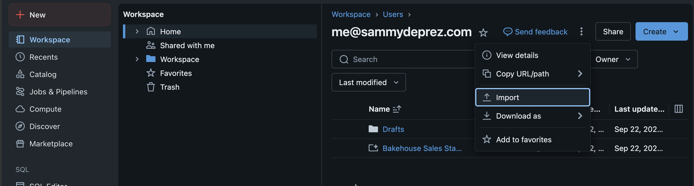
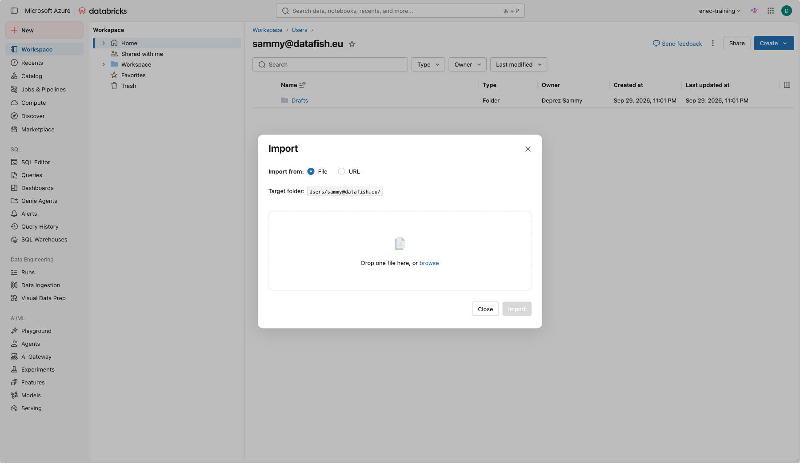
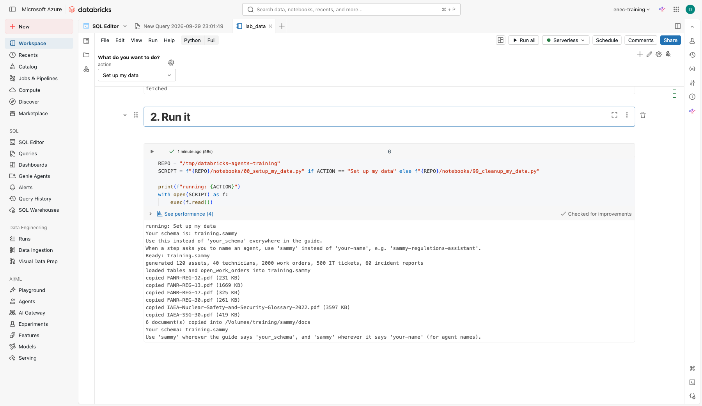

# Before you start

## Log in

1. Open the workspace URL your trainer gives you.
2. Sign in with the account you received. Change the temporary password if asked.
3. In the left navigation, confirm you can see **SQL Editor**, **Genie**, **Agents** and **Playground**. If any is missing, tell the trainer.

## Set up your data

Nobody has prepared any data for you — you create your own with one click. Nothing to download or
clone by hand; one notebook import does it.

1. In the left navigation, open **Workspace**. Next to **Create** in the top right, click **⋮** and choose **Import**.

    

2. Select **URL** and paste:

    ```text
    https://raw.githubusercontent.com/sammydeprez/databricks-agents-training/develop/notebooks/lab_data.py
    ```

    

3. Click **Import**, open the notebook it creates (called **lab_data**), leave the setting on **Set up my data**, and click **Run all** at the top. It takes under a minute. Leave **Catalog** empty unless your trainer gives you a catalog name — then type it there.
4. At the bottom, note the catalog and schema it prints, for example `enec_training.jsmith`. From here on, wherever this guide says `your_catalog.your_schema`, use that; wherever it says `your-name`, use the dashed version it also prints (for example `jsmith`).

    

Keep this notebook — you'll use it again at the end of Day 2 to clean up, and it's safe to re-run at
any point in between too, for example if something looks broken. It replaces your data rather than
failing because it already exists.

Your schema now contains:

| Table | Rows | Used in |
|---|---|---|
| `work_orders` | 2,000 | Lab 2, Lab 5 |
| `assets` | 120 | Lab 2 |
| `technicians` | 40 | Lab 2 |
| `it_tickets` | 500 | Lab 3 |
| `incident_reports` | 60 | Trainer demo |
| `meeting_transcripts` | 10 | Lab 3, capstone |
| `monthly_kpis` | 48 | Capstone |

And a volume `docs` with the public regulation PDFs used in Lab 4, plus a `memo_templates` subfolder
used by the capstone, both copied in automatically.

## Vocabulary you will hear today

| Term | Plain meaning |
|---|---|
| LLM | The model that reads and writes text |
| Prompt | What you type to the model, including instructions |
| Token | A piece of a word; models charge and limit by tokens |
| RAG | The model looks things up in your documents before answering |
| Agent | A model that can decide to use tools (run SQL, search documents) |
| Unity Catalog | Where tables, files, functions and agents live, with permissions |

## Conventions in this guide

- **Bold** menu names are things to click, in the order written: **Configure > Instructions**.
- Code blocks have a copy button in the top right corner.
- Replace `your_catalog`, `your_schema` and `your-name` with the names the setup notebook printed for you, everywhere.
